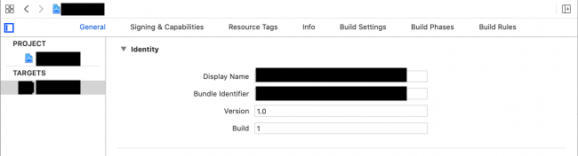

# I-Cloud Sync with Coredata

This repository is an example project of how to integrate coredata database and sync to the I-Cloud.

### Preview

### Certificate Setup
1. Select the `Signing & Capabilities` tab in the target editor
2. Click on `+ Capability`
3. Choose `iCloud`

##### Select the Signing & Capabilities tab in the target editor
Open ICloudSync.xcworkspace in Xcode. Select the ICloudSync project in the Project navigator, then select the ICloudSync target. With the General tab selected, replace the Bundle Identifier with something unique. Standard practice is to use reverse domain name notation and include the project name.

    

##### Click on + Capability

    

At this point, Xcode might prompt you to enter the Apple ID associated with your iOS developer account. If so, then type it in as requested.

##### Choose iCloud
Next, enable CloudKit by checking the CloudKit checkbox in the Services group.

    

<>
Finally, click on + under Containers to add a new container, if CloudKit didn’t automatically create one for you.

    

In the pop-up, add your bundle identifier.

    

This creates a default container named iCloud.<your app’s bundle ID>.

    

For CloudKit Dashboard, you can do this using the CloudKit dashboard. Click CloudKit Dashboard, which you can find in the target’s Signing & Capabilities pane, under iCloud or by opening https://icloud.developer.apple.com/dashboard/ in your browser.
